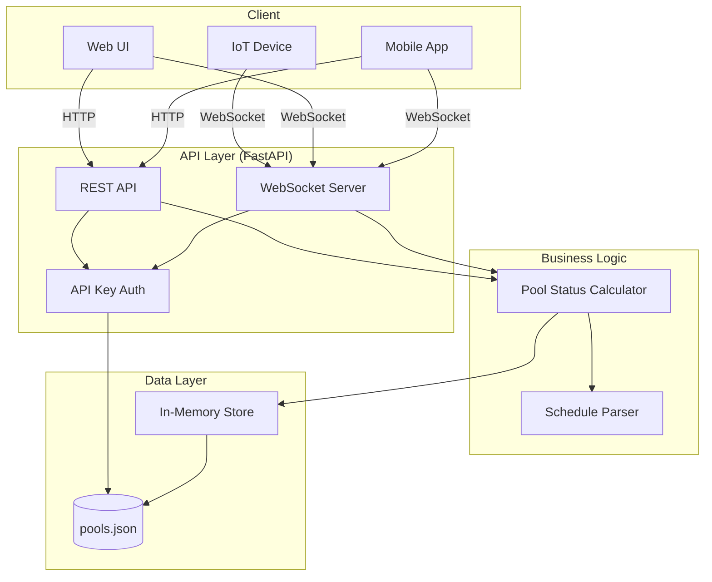

# Swimming Pool Management Service

Self-hosted service for managing swimming pool filtering schedules with real-time status updates.

## Architecture



## Modules

```
backend/
├── main.py        # Entry point
├── api.py         # FastAPI routes, WebSocket handlers
├── db.py          # Configuration loader, in-memory storage
├── status.py      # Schedule parsing, filtering status calculation
└── pool_status.py # Per-pool status with manual override support
```

## Configuration

Create `pools.json` with pools configuration:

```json
{
  "api_key": "your-secret-api-key",
  "pools": [
    {
      "id": 1,
      "name": "Olympic Pool",
      "description": "Main competition pool",
      "location": "Building A, 1st Floor",
      "capacity": 50,
      "schedule": [
        {"startAt": "06:00", "duration": "3h"},
        {"startAt": "12:00", "duration": "2h"},
        {"startAt": "18:00", "duration": "4h 30m"}
      ]
    }
  ]
}
```

### Configuration Options

| Field | Type | Required | Description |
|-------|------|----------|-------------|
| `api_key` | string | No | API key for authentication. Leave empty to disable. |
| `pools` | array | Yes | List of pool configurations |
| `pools[].id` | integer | Yes | Unique pool identifier |
| `pools[].name` | string | Yes | Pool name |
| `pools[].description` | string | No | Pool description |
| `pools[].location` | string | Yes | Pool location |
| `pools[].capacity` | integer | Yes | Pool capacity |
| `pools[].schedule` | array | No | Filtering schedule entries |
| `schedule[].startAt` | string | Yes | Start time (HH:MM format) |
| `schedule[].duration` | string | Yes | Duration (e.g., "3h", "2h 30m", "45m") |

## API Endpoints

### REST API

All REST endpoints require `X-API-Key` header if authentication is enabled.

#### Get all pools
```http
GET /pools
```
Response:
```json
[
  {
    "id": 1,
    "name": "Olympic Pool",
    "description": "Main competition pool",
    "location": "Building A, 1st Floor",
    "capacity": 50,
    "schedule": [...]
  }
]
```

#### Get pool by ID
```http
GET /pools/{pool_id}
```

#### Get pool status
```http
GET /pools/{pool_id}/status
```
Response:
```json
{
  "pool_id": 1,
  "name": "Olympic Pool",
  "filtering": true,
  "ends_at": "09:00",
  "remaining_minutes": 120,
  "next_filter": null,
  "last_filtered": null
}
```

#### Start filtering manually
```http
POST /pools/{pool_id}/start?by=user_id
```

#### Stop filtering manually
```http
POST /pools/{pool_id}/stop?by=user_id
```

#### Resume scheduled filtering
```http
POST /pools/{pool_id}/resume
```

### WebSocket API

Connect with API key via query parameter:
```javascript
const ws = new WebSocket('ws://localhost:8000/ws/status?api_key=your-key');
```

#### All pools status (`/ws/status`)
Receives status updates for all pools every 30 seconds.

```javascript
ws.onmessage = (event) => {
  const status = JSON.parse(event.data);
  // {"pool_id":1,"name":"Olympic Pool","filtering":false,...}
};
```

#### Single pool status (`/ws/status/{pool_id}`)
Receives status updates for a specific pool every 30 seconds.

```javascript
const ws = new WebSocket('ws://localhost:8000/ws/status/1?api_key=your-key');
```

## Status Response Fields

| Field | Type | Description |
|-------|------|-------------|
| `filtering` | boolean | Whether the pool is currently filtering |
| `manual_override` | boolean | Whether manual control is active |
| `ends_at` | string | When current filtering ends (HH:MM) |
| `remaining_minutes` | integer | Minutes until filtering ends |
| `next_filter` | string | When next scheduled filtering starts (HH:MM) |
| `last_filtered` | string | When last filtering ended (HH:MM) |
| `started_at` | string | When manual start was triggered (ISO timestamp) |
| `started_by` | string | Who triggered manual start |
| `stopped_at` | string | When manual stop was triggered (ISO timestamp) |
| `stopped_by` | string | Who triggered manual stop |

## Build

### Local Development

```bash
cd backend
pip install -r requirements.txt
python -m uvicorn main:app --reload
```

### Docker

```bash
docker build -t swimming-pool-mgt -f docker/Dockerfile .
```

## Deploy

### Docker Run

```bash
docker run -d \
  --name pool-mgt \
  -p 8000:8000 \
  -v /path/to/pools.json:/data/pools.json \
  swimming-pool-mgt
```

### Docker Compose

```yaml
version: '3.8'
services:
  pool-mgt:
    build: .
    ports:
      - "8000:8000"
    volumes:
      - ./pools.json:/data/pools.json
    restart: unless-stopped
```

### Environment Variables

| Variable | Default | Description |
|----------|---------|-------------|
| `POOLS_CONFIG` | `/data/pools.json` | Path to pools configuration file |

## API Documentation

Interactive API docs available at:
- Swagger UI: `http://localhost:8000/docs`
- ReDoc: `http://localhost:8000/redoc`
