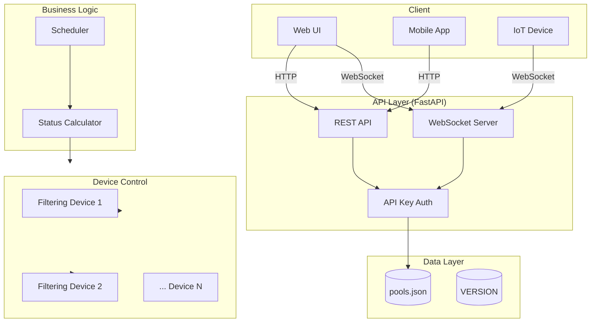

# Swimming Pool Management Service

Self-hosted service for managing swimming pool filtering schedules with real-time status updates and device control.

## Quick Start

```bash
# Build and run
./cicd/run.sh -b

# Or run with existing image
./cicd/run.sh
```

## Architecture



## Project Structure

```
.
├── VERSION              # Version file
├── pools.json           # Pool configuration
├── docker-compose.yml    # Docker compose configuration
├── Dockerfile           # Docker build file
├── cicd/
│   ├── build.sh         # Build Docker image
│   ├── publish.sh       # Publish to registry
│   └── run.sh           # Run service
└── backend/
    ├── main.py           # Entry point
    ├── api.py            # FastAPI routes, WebSocket handlers
    ├── db.py             # Configuration loader
    ├── version.py        # Version management
    ├── status.py         # Schedule parsing, status calculation
    ├── pool_status.py    # Per-pool status, device control
    ├── device.py         # HTTP device client
    └── scheduler.py      # Automated filtering scheduler
```

## Build, Publish & Run

### Build

```bash
# Build specific version
./cicd/build.sh -v 0.2.0

# Build with additional tag
./cicd/build.sh -v 0.2.0 -t beta

# Build using VERSION file
./cicd/build.sh
```

### Publish

```bash
# Publish to Docker Hub
./cicd/publish.sh -v 0.2.0

# Publish with latest tag
./cicd/publish.sh -v 0.2.0 -l

# Publish to custom registry
./cicd/publish.sh -v 0.2.0 -r ghcr.io/username

# Publish dev tag
./cicd/publish.sh -v 0.2.0 -d
```

### Run

```bash
# Build and run
./cicd/run.sh -b -v 0.2.0

# Run with existing image (reads VERSION file)
./cicd/run.sh

# Run with custom port
./cicd/run.sh -p 8080

# Run with custom pools config
./cicd/run.sh -d /path/to/pools.json

# Run with custom scheduler interval
./cicd/run.sh -i 30

# View logs
./cicd/run.sh --logs

# Stop service
./cicd/run.sh --stop

# Rebuild and restart
./cicd/run.sh -b -r
```

## Configuration

### pools.json

```json
{
  "api_key": "your-secret-api-key",
  "pools": [
    {
      "id": 1,
      "name": "Olympic Pool",
      "description": "Main competition pool",
      "location": "Building A, 1st Floor",
      "capacity": 50,
      "schedule": [
        {"startAt": "06:00", "duration": "3h"},
        {"startAt": "12:00", "duration": "2h"},
        {"startAt": "18:00", "duration": "4h 30m"}
      ],
      "device": {
        "name": "Olympic Pool Filter Pump",
        "start_url": "http://192.168.1.100/pump/on",
        "stop_url": "http://192.168.1.100/pump/off",
        "status_url": "http://192.168.1.100/pump/status"
      }
    }
  ]
}
```

### Configuration Fields

| Field | Type | Required | Description |
|-------|------|----------|-------------|
| `api_key` | string | No | API key for authentication. Empty to disable. |
| `pools` | array | Yes | List of pool configurations |
| `pools[].id` | integer | Yes | Unique pool identifier |
| `pools[].name` | string | Yes | Pool name |
| `pools[].description` | string | No | Pool description |
| `pools[].location` | string | Yes | Pool location |
| `pools[].capacity` | integer | Yes | Pool capacity |
| `pools[].schedule` | array | No | Filtering schedule entries |
| `schedule[].startAt` | string | Yes | Start time (HH:MM format) |
| `schedule[].duration` | string | Yes | Duration (e.g., "3h", "2h 30m", "45m") |
| `pools[].device` | object | No | Filtering device configuration |
| `device.name` | string | Yes | Device name |
| `device.start_url` | string | Yes | HTTP URL to start device |
| `device.stop_url` | string | Yes | HTTP URL to stop device |
| `device.status_url` | string | No | HTTP URL to check device status |

### Filtering Device Examples

#### Simple HTTP Device (Sonoff, Tasmota)

```json
"device": {
  "name": "Pool Pump",
  "start_url": "http://192.168.1.100/cm?cmnd=Power%20On",
  "stop_url": "http://192.168.1.100/cm?cmnd=Power%20Off"
}
```

#### Home Assistant REST Command

```json
"device": {
  "name": "Pool Pump via HA",
  "start_url": "http://homeassistant:8123/api/services/switch/turn_on",
  "stop_url": "http://homeassistant:8123/api/services/switch/turn_off",
  "status_url": "http://homeassistant:8123/api/states/switch.pool_pump"
}
```

#### OpenHab HTTP Binding

```json
"device": {
  "name": "Pool Pump via OpenHAB",
  "start_url": "http://openhab:8080/rest/items/PoolPump_Switch",
  "stop_url": "http://openhab:8080/rest/items/PoolPump_Switch"
}
```

## Environment Variables

| Variable | Default | Description |
|----------|---------|-------------|
| `BUILD_VERSION` | - | Service version (set at build time) |
| `POOLS_CONFIG` | `/data/pools.json` | Path to pools configuration |
| `SCHEDULER_INTERVAL` | `60` | Scheduler check interval in seconds |
| `API_PORT` | `8000` | Exposed API port |

## API Endpoints

API version: `/api/v1`

### Service Info

#### Get service info
```http
GET /
```
Response:
```json
{"service":"Swimming Pool Management Service","version":"0.2.0","docs":"/docs"}
```

#### Get version
```http
GET /api/v1/version
```
Response:
```json
{"version": "0.2.0"}
```

### REST API

All REST endpoints require `X-API-Key` header if authentication is enabled.

#### List all pools
```http
GET /api/v1/pools
```

#### Get pool by ID
```http
GET /api/v1/pools/{pool_id}
```

#### Get pool status
```http
GET /api/v1/pools/{pool_id}/status
```
Response:
```json
{
  "pool_id": 1,
  "name": "Olympic Pool",
  "filtering": true,
  "manual_override": false,
  "device_controlled": true,
  "device_running": true,
  "ends_at": "09:00",
  "remaining_minutes": 120
}
```

#### Start filtering manually
```http
POST /api/v1/pools/{pool_id}/start?by=user_id
```

#### Stop filtering manually
```http
POST /api/v1/pools/{pool_id}/stop?by=user_id
```

#### Resume scheduled filtering
```http
POST /api/v1/pools/{pool_id}/resume
```

### WebSocket API

```javascript
// All pools status
const ws = new WebSocket('ws://localhost:8000/api/v1/ws/status?api_key=your-key');

// Single pool status
const ws = new WebSocket('ws://localhost:8000/api/v1/ws/status/1?api_key=your-key');
```

## Authentication

```bash
# REST API
curl -H "X-API-Key: your-secret-api-key" http://localhost:8000/api/v1/pools

# WebSocket
const ws = new WebSocket('ws://localhost:8000/api/v1/ws/status?api_key=your-secret-api-key');
```

Without valid key: REST returns `401`, WebSocket closes with code `4001`.

## API Documentation

Interactive API docs available at:
- Swagger UI: `http://localhost:8000/docs`
- ReDoc: `http://localhost:8000/redoc`
